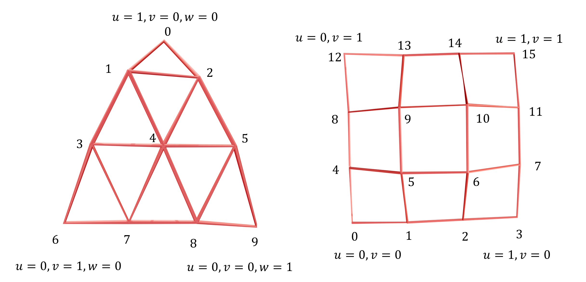

# BezierGreen

## Introduction
This GitHub repository contains the source code for the implementation of the paper "Flexible 3D Cage-based Deformation via Green Coordinates on Bézier Patches". Our implementation builds upon the excellent survey work: [CageModeler](https://github.com/DanStroeter/CageModeler). We sincerely thank the authors for their contributions—our work truly stands on the shoulders of giants.

## Run
Our configuration environment is similar to [CageModeler](https://github.com/DanStroeter/CageModeler), using CMake to generate the project, which has cross-platform generation capabilities. Here, we specifically introduce the experience of configuring with CMake-gui, vcpkg, and Visual Studio in Windows.

First, clone the repository:
```bash
git clone https://github.com/Submanifold/BezierGreen.git
```

In the root directory of the project, run:
```bash
cmake-gui
```

Where is the source code: Choose the root directory of this project (where `CMakeLists.txt` and `vcpkg.json` are located).

Where to build the binaries: Create a `build` folder in the root directory and select this folder.

Then, click `Configure`, select `Visual Studio`. Click `Specify toolchain file for cross-compiling`, and specify the location of your vcpkg (you can download vcpkg to the project root directory). The required packages are in `vcpkg.json`, and using CMake-gui to select the toolchain should automatically download the required packages.

After that, the Visual Studio project `cageDeformation3D.sln` will be generated in the `build` directory. Select the `RelWithDebInfo` mode, build the solution, and the `cageDeformation3D.exe` will be generated. If any DLL files are missing, simply place the corresponding files in the same directory as `cageDeformation3D.exe`.

The abbreviation of our method is BGC.

Run Command:
```bash
./cageDeformation3D.exe --model=/path/to/model.obj --cage=/path/to/source_bezier_cage.txt --cage-deformed=/path/to/target_bezier_cage.txt --BGC
```

Or input the command parameters starting with `--model` in Visual Studio. The `data` folder contains some data, and the cage is currently stored in txt files, which are either 3rd-order Bézier triangles or tensor product Bézier patches. Therefore, each line contains 30 (10 control points x, y, z for Bézier triangle) or 48 (16 control points x, y, z for tensor product Bézier patch) values, arranged in the following order:



Additionally, if you want to use the cross-product Neumann term method mentioned in Appendix D, you can change `cross_product_BGC` to `true` in the main function (around line 127). We are optimizing the code, and trying to support inputs of different dimensions for better scalability, although using dynamic length for some variables is slightly slower than using fixed-length arrays for 3rd-order cases.

## Visualization
To preliminarily visualize the Bézier cage and the mesh's positional relationship, we provide a simple Blender Python file in the `./vis` folder, which includes some code in the script.

## Citation
To be updated.